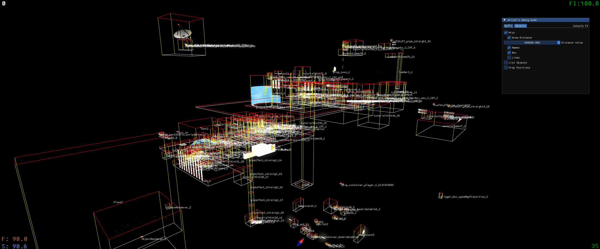

# Voice of the Void/Unreal Engine Debug Mode
**for resercheing purposes**

Using engine features to interact with a Unreal Engine-based game. Using DLL injection.


Bypass tutorial restrictions



Full Spawn menu (probably), Cheat menu, and true noclip


## Features

* Exploits
  * Console F2

   | A few interesting commands |  |
  | ------ | ------ |
  | Toggledebugcamera | Toggles the player controller to the debug camera controller. |
  | Summon | Summon objects. Example: ```Summon prop_gravgun_c```. You can use [this list][secret] to look up object names. |
  | Show staticmeshes/BSP | Disables objects / walls. BSP only shows the result in tutorial level. |
  | Open | Switches to an existing level. Example: ```Open tutorial3_1```. You can use [this list][levels]. |
  * Game Time (Additional window)
  * Fly
    * Disable Collision
  * Add points
  * Chad mod (Large objects lose weight)
  * No Damage
  * No Draining food
  * No Draining sleep
  * Speed of time
  * Teleport
  * Infinity Fuel
  * Infinity Health

* ESP
  * Names
  * Box
  * Lines
  * Change draw distance

* List Objects (View list visible objects and deleted objects)

* Change Prop position (Teleport objects to player)
* Destroy Prop

## Using
1. Download from release (DLL and, if you don't have the injector, you will also need the exe file) / Compile project
2. Place the exe file together with the DLL in any convenient place.
3. Start the game
4. Start exe file (Don't need administrator privileges)
5. Press "Insert" in the game for open a start window

## How to Compile
You will need developer tools directly related to Unreal Engine and Voice of the Void. You will have to find them on your own. I do not have permission to distribute them.

1. Clone this repo
2. Put developer tools in "Project2" folder
3. Make sure Realese and x64 are selected
4. Compile

## Interesting projects

* [DebugMod] - A very powerful debugging tool by `acitulen` in the form of a game modification

   [secret]: <https://raw.githubusercontent.com/Vyollet/Voice-of-the-Void-Debug-Mode/main/Project2/.secrets>
   [levels]: <https://votv-ru.fandom.com/ru/wiki/%D0%9C%D0%B8%D1%80%D1%8B_%D0%B8_%D1%82%D0%B5%D1%81%D1%82%D0%BE%D0%B2%D1%8B%D0%B5_%D1%83%D1%80%D0%BE%D0%B2%D0%BD%D0%B8>
   [DebugMod]: <https://thunderstore.io/c/voices-of-the-void/p/acitulen/DebugMod/>
