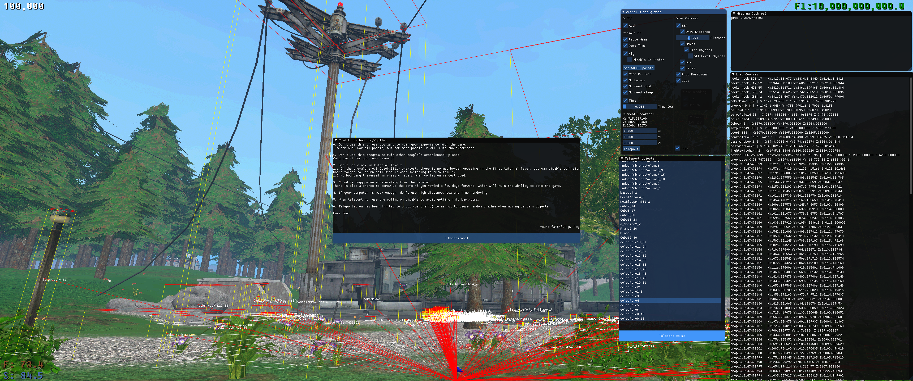

# Voice of the Void/Unreal Engine Debug Mode
**for resercheing purposes**

Using engine features to interact with a Unreal Engine-based game. Using DLL injection.

## Features
* ESP
  * Change draw distance
  * Names
    * List visible objects (list cookies)
	  * List all objects
  * Box
  * Lines

* Change Prop position (Teleport objects to player)
* Logs (View deleted objects)

* Exploits
  * Console F2
  * Game Time (Additional window)
  * Fly
    * Disable Collision
  * Add points
  * Chad mod (Large objects lose weight)
  * No Damage
  * No Draining food
  * No Draining sleep
  * Speed of time
  * Teleport

## Using
1. Download from realese / Compile project
2. Place the exe file together with the dll in any convenient place
3. Start the game
4. Start exe file (Administrator rights are not required)
5. Press "Insert" for open a start window

## How to Compile
You will need developer tools directly related to Unreal Engine and Voice of the Void. You will have to find them on your own. I do not have permission to distribute them.

1. Clone this repo
2. Put developer tools in "Project2" folder
3. Compile
